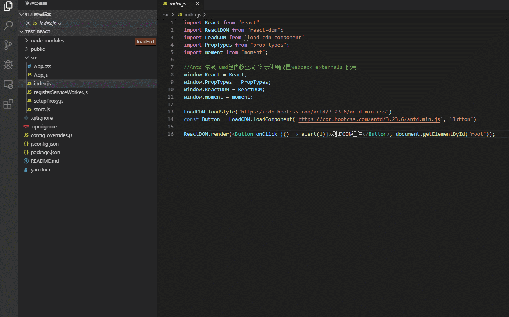

# 可加载 cdn 的 umd 包
- umd包依赖需要再全局定义
- 特殊场景使用
- 此包依赖systemjs模块加载库 webpack下使用会产生警告



```javascript
import React from "react"
import LoadCDN from 'load-cdn-component'
import PropTypes from "prop-types";
import ReactDOM from "react-dom";
import moment from "moment";

//Antd 依赖 umd包依赖全局 实际使用配置webpack externals 使用
window.React = React;
window.PropTypes = PropTypes;
window.ReactDOM = ReactDOM;
window.moment = moment;

LoadCDN.loadStyle("https://cdn.bootcss.com/antd/3.23.6/antd.min.css")
const Button = LoadCDN.loadComponent('https://cdn.bootcss.com/antd/3.23.6/antd.min.js', 'Button')

ReactDOM.render(<Button onClick={() => alert(1)}>测试CDN组件</Button>, document.getElementById("root"));

```
